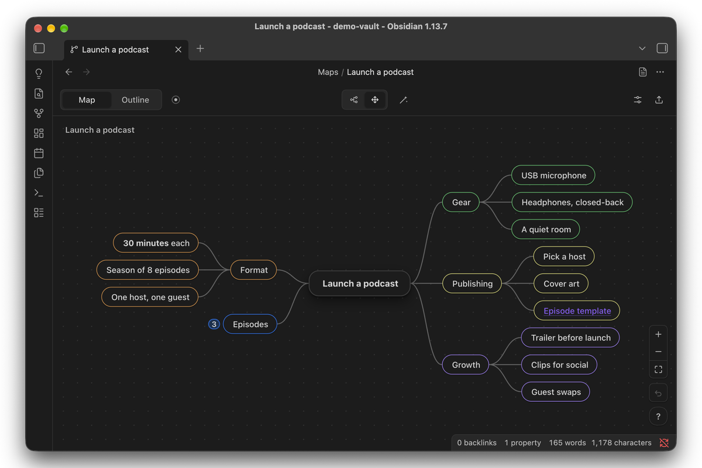

# Ideascape

Turn a note into a keyboard-first mindmap, and read the same note as an outline. The map stays a plain Markdown list, so the note still works everywhere else in Obsidian.


## What it does

- **One note, two views.** Press ⌘1 for the map and ⌘2 for the outline. Both edit the same note.
- **Built for the keyboard.** Tab adds a child, Enter adds a sibling, the arrow keys move around, and typing replaces the selected node's text. Press `?` in a map to see every shortcut.
- **Plain Markdown underneath.** The title is the note's heading and each node is a list item with a block id, so you can link to any node (`[[Plan#^a1b2c3]]`), search it, and read it on mobile or in git.
- **Mind map or free layout.** Branches spread either side of the centre, or you place nodes yourself. Tidy puts a free layout back in order.
- **Formatting while you type.** Bold, italic, underline, strikethrough, highlight, code, links, headings, alignment, checkboxes and numbered items, from the keyboard or the bar above the node.
- **Themes that fit your vault.** Follow your Obsidian theme in light or dark mode, pick Paper, Slate, Graphite or Midnight, or make your own. Each map can keep its own theme and node style.
- **Focus on one branch.** Hide everything else while you work on it.
- **Bring things in, send things out.** Paste a Markdown list, drop in a `.canvas` or OPML file, or drag notes from the file explorer. Export as PNG, Markdown, OPML or JSON Canvas.




## Install

Ideascape 0.9 is a beta. Until it's listed in Obsidian's community plugins, install it one of two ways:

- **With BRAT:** install the [BRAT](https://github.com/TfTHacker/obsidian42-brat) plugin, choose **Add beta plugin**, and enter `jonathanmcw/obsidian-ideascape`.
- **By hand:** download `main.js`, `manifest.json` and `styles.css` from the [latest release](https://github.com/jonathanmcw/obsidian-ideascape/releases/latest) into `<your vault>/.obsidian/plugins/ideascape/`, then turn on **Ideascape** in **Settings → Community plugins**.

Once it's listed, find it in **Settings → Community plugins → Browse**.

Found a bug, or have an idea? [Open an issue](https://github.com/jonathanmcw/obsidian-ideascape/issues).

## Getting started

1. Turn Ideascape on. A short welcome shows what a map is, the two views, how a note becomes a map, and ends on the tour.
2. **New map:** the ribbon button, a folder's **New map here**, or the command **Create a new map**.
3. **A note you already have:** right-click it and choose **Open as a map**. Its heading becomes the centre and its lists become branches.
4. **Take the tour:** a map where every node shows a feature by using it. It's in the ribbon menu, in Settings, and the command **Take the tour**. Press `?` in any map for every shortcut.


### Keys to know

| Keys | What they do |
|---|---|
| Tab · Enter | Add a child · add a sibling |
| ⇧Tab | Move a node out a level |
| ↑ ↓ ← → | Move the selection (hold ⇧ to add to it) |
| ⌘E or double-click | Edit the node's text |
| ⌘B ⌘I ⌘U | Bold · italic · underline |
| ⌘↑ ⌘↓ | Reorder among siblings |
| ⌘. | Fold or unfold a branch |
| ⌥⌘F | Focus on the selected branch |
| ⌘F | Find in the map |
| ⌘1 ⌘2 | Map · outline |
| ⌥⌘= ⌥⌘- · ⇧⌘0 | Zoom in · zoom out · fit the map to the window |
| ? | All shortcuts, with a filter |
| ⌘/ | Document panel: theme and node style |
| ⌘Z · ⇧⌘Z | Undo · redo |

On Windows and Linux, use Ctrl for ⌘.


## How a map is saved

A map is an ordinary Markdown note with one property that marks it.


Opened as text, it looks like this:

```markdown
---
ideascape: root
---
# Weekend in Kyoto

- Friday ^v31gjg
  - Arrive by train ^wckm2y
  - Gion at dusk ^xtrtau
- Saturday ^or3x1k
  - Fushimi Inari ^kooah6

%%ideascape
{"v":1,"pos":{"root":[0,0],"v31gjg":[-177,-92]}}
%%
```

- The heading is the centre of the map, and the nested list is the tree.
- Any other text in the note (paragraphs, code, callouts) is kept. Text between list items belongs to the item above it: it moves with that item, and goes to the end of the list if the item is deleted.
- Positions, folds and the map's own look are kept in the `%%` comment at the end, which Obsidian doesn't show in reading view. Delete it and the map lays itself out again, with its folds and its own look back to the defaults.
- Turning a note you already have into a map only adds the property, block ids and that comment. If more would change, the plugin asks first and offers to work on a copy.
- Without Ideascape, a map is still an ordinary note: a heading and a nested list, with a short block id at the end of each item and the `%%` comment hidden in reading view.


## Settings

- **Maps folder:** where new maps are created.
- **Defaults for new maps:** theme, node style and layout. A map's document panel can override each one.
- **Outline width:** a centred column or the full window.
- **Esc removes an empty node:** leaving a node you haven't typed in takes it back out.
- **Open marked notes as maps:** turn off to open map notes in the editor, with **Open as a map** in the file menu.
- **Reduce motion**, **Ribbon icon** and **Mark maps in the file explorer**.

## Privacy

The plugin works entirely offline. It makes no network requests, collects no data, and only writes to the maps you edit, new maps you create and files you export.

## Compatibility

Obsidian 1.7.2 or later. Made for desktop and mobile; this beta has been tested on desktop (macOS) so far, so reports from Windows, Linux and mobile are especially welcome.

## Development

```bash
npm install
npm run build          # type-check, bundle main.js, write styles.css
npm run dev            # rebuild main.js on change
npm test               # node --test
npm run lint           # eslint-plugin-obsidianmd
npm run install:vault -- /path/to/vault [--enable]   # or set OBSIDIAN_VAULT
```

Releases are built by GitHub Actions when a version tag (for example `0.9.0`) is pushed: the workflow builds, attests `main.js`, `manifest.json` and `styles.css`, and drafts the release.

## Support

Ideascape is free. Bug reports and ideas go to [GitHub Issues](https://github.com/jonathanmcw/obsidian-ideascape/issues). If it helps you think, you can buy me a coffee.

<a href="https://buymeacoffee.com/jonathanmcw"></a>

## License

[MIT](LICENSE) © Jonathan Wong
