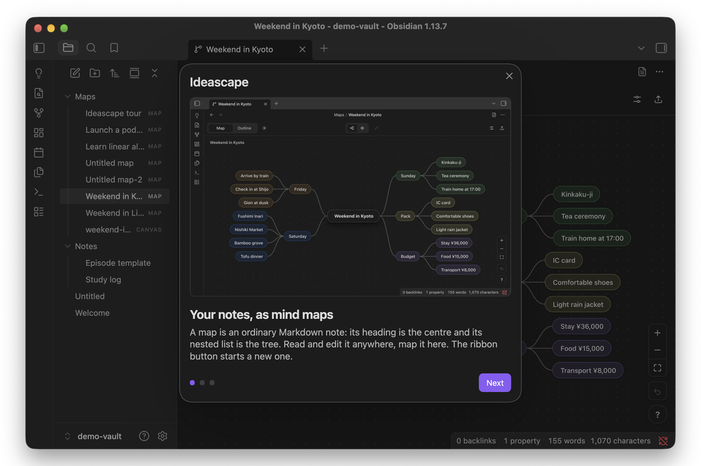
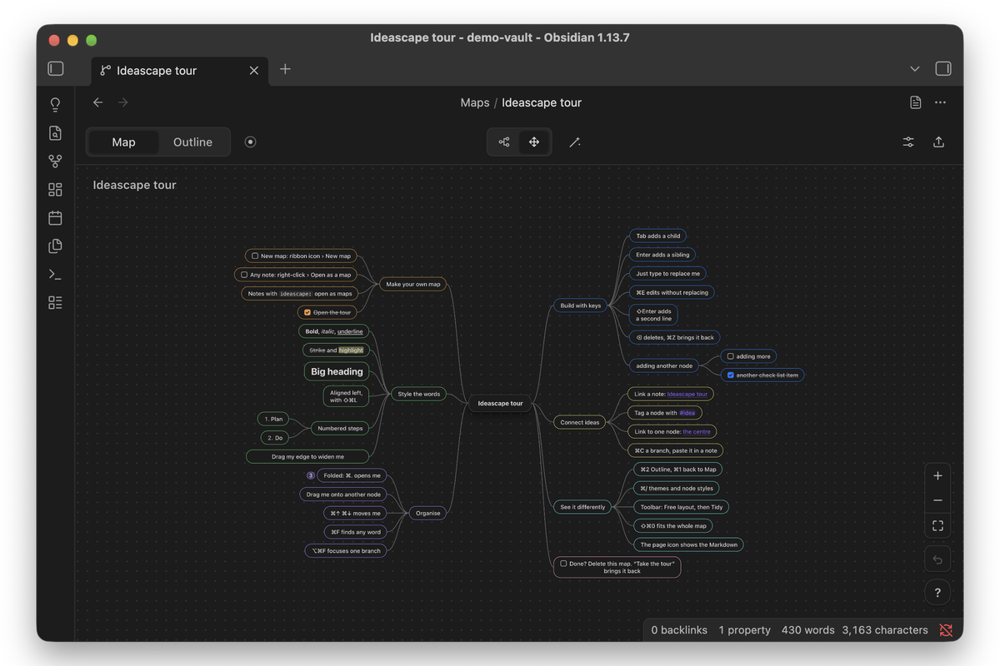
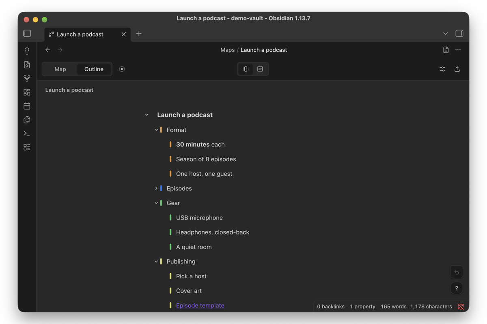
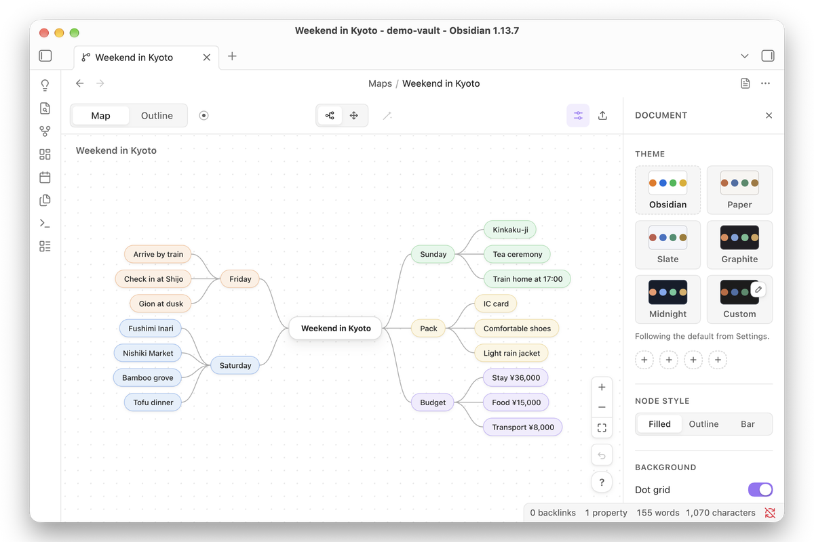
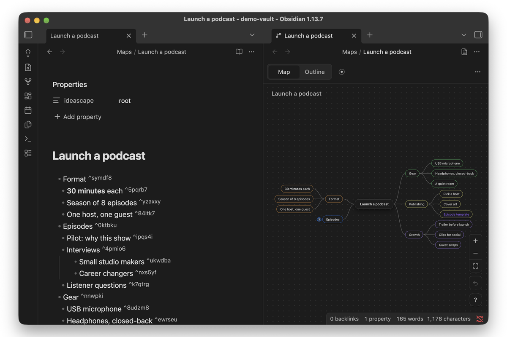
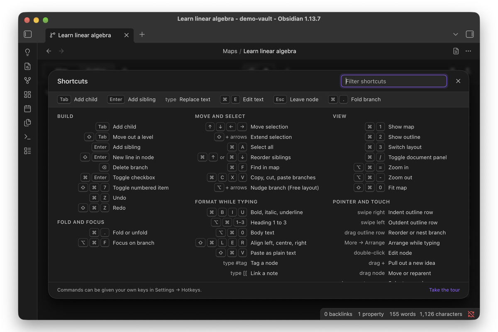
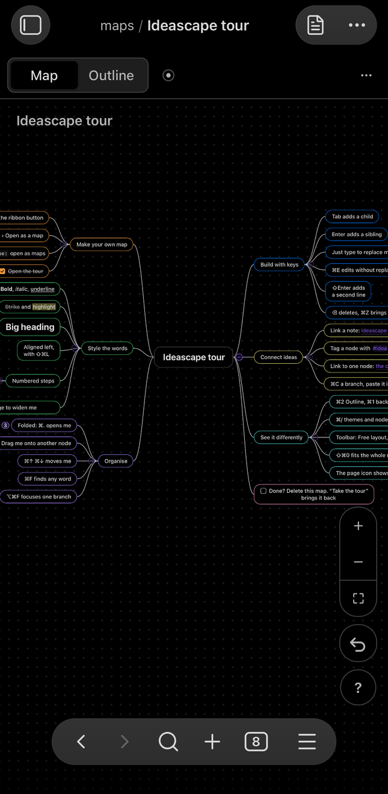
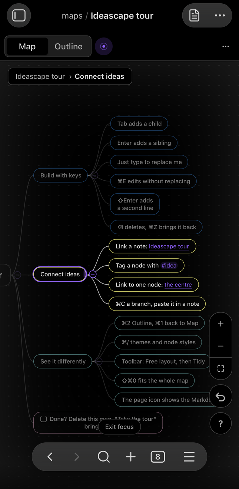
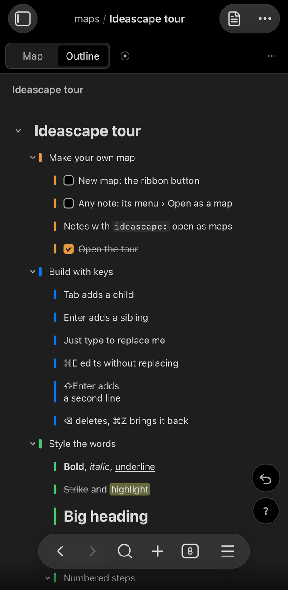
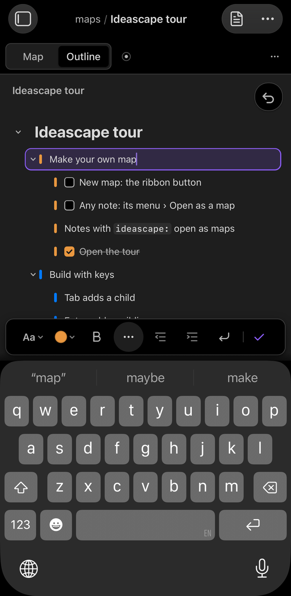

# Ideascape


A thought arrives faster than you can draw it, so Ideascape lets you type it. Tab adds a child, Enter adds a sibling, the arrows move, and typing edits the selected node; the map keeps up and your hands stay on the keyboard. One shortcut turns the same note into an outline, and another turns it back. Underneath it is a plain Markdown list: readable anywhere, and still yours without the plugin.

## What it does

- **Built for the keyboard.** Tab adds a child, Enter adds a sibling, the arrow keys move around, and typing replaces the selected node's text. Nothing between the thought and the node asks for the mouse. Press `?` in a map to see every shortcut.
- **One note, two views.** Press ⌘1 for the map and ⌘2 for the outline. Both edit the same note, so you can find the shape in one and write in the other.
- **Plain Markdown underneath.** The title is the note's heading and each node is a list item with a block id, so you can link to any node (`[[Plan#^a1b2c3]]`), search it, and read it on mobile or in git. Uninstall Ideascape and it is still an ordinary note.
- **Mind map or free layout.** Branches spread either side of the centre, or you place nodes yourself. Tidy puts a free layout back in order.
- **Formatting while you type.** Bold, italic, underline, strikethrough, highlight, code, links, headings, alignment, checkboxes and numbered items, from the keyboard or the bar above the node.
- **Themes that fit your vault.** Follow your Obsidian theme in light or dark mode, pick Paper, Slate, Graphite or Midnight, or make your own. Each map can keep its own theme and node style.
- **Focus on one branch.** Bring it forward and dim the rest while you work on it.
- **On a phone or tablet.** The same maps, with a bar above the keyboard for styling, nesting and moving rows, and everything sized for a thumb.
- **Dropped and pasted content (beta).** This is the one part of Ideascape still marked beta. Markdown lists, `.canvas` files, OPML and notes dragged in from the file explorer are still being refined, so review what arrives. Turning one of your own notes into a map is not beta: it tells you before it rewrites anything, and offers to convert a copy instead.
- **Export.** Save a map as `.canvas`, Markdown, OPML, or a picture of the shape on screen in the theme it is in. Exports land beside the note, under a name nothing in the vault has yet.

<table>
  <tr>
    <td width="50%" valign="top"><br><b>First run.</b> Three slides: what a map is, how map and outline views relate, and the keyboard basics. Start opens the tour.</td>
    <td width="50%" valign="top"><br><b>The tour.</b> A map where every node is the feature it describes: the bold node is bold, the folded one is folded.</td>
  </tr>
  <tr>
    <td valign="top"><br><b>Outline.</b> The same note as a list, one key away. Fold, focus and find work here too.</td>
    <td valign="top"><br><b>Themes.</b> Follow your vault in light or dark, or pin Paper, Slate, Graphite or Midnight to one map from the document panel.</td>
  </tr>
  <tr>
    <td valign="top"><br><b>Plain Markdown underneath.</b> A heading, a nested list, a block id per node. The note reads anywhere.</td>
    <td valign="top"><br><b>Every shortcut.</b> Press <code>?</code> in a map for the sheet, with a filter and the six keys to learn first.</td>
  </tr>
</table>

<table>
  <tr>
    <td width="25%" valign="top"><br><b>The map.</b> Pinch to zoom, drag to pan.</td>
    <td width="25%" valign="top"><br><b>Focus.</b> One branch forward, the rest dimmed.</td>
    <td width="25%" valign="top"><br><b>Outline.</b> The same note as a list.</td>
    <td width="25%" valign="top"><br><b>Typing.</b> Styling and nesting, above the keyboard.</td>
  </tr>
</table>

## Install

Install Ideascape from **Settings → Community plugins → Browse**: search for **Ideascape**, select **Install**, then turn it on.

[View Ideascape in the Obsidian Community directory](https://community.obsidian.md/plugins/ideascape).

For pre-release builds, install [BRAT](https://github.com/TfTHacker/obsidian42-brat), choose **Add beta plugin**, and enter `jonathanmcw/obsidian-ideascape`. To install by hand, download `main.js`, `manifest.json` and `styles.css` from the [latest release](https://github.com/jonathanmcw/obsidian-ideascape/releases/latest) into `<your vault>/.obsidian/plugins/ideascape/`.

Found a bug, or have an idea? [Open an issue](https://github.com/jonathanmcw/obsidian-ideascape/issues).

## Getting started

1. Turn Ideascape on. A short welcome shows what a map is, how map and outline views relate, and the keyboard basics; Start opens the tour.
2. **New map:** the ribbon button, a folder's **New map here**, or the command **Create a new map**.
3. **Existing notes:** **Open as a map**, from the note's menu or the command. If the map would rewrite anything beyond what it adds on purpose, you are told how many lines and shown the first of them, with **Convert a copy** offered instead.
4. **Take the tour:** a map where every node shows a feature by using it. It's in Settings, in the shortcut sheet, and the command **Take the tour**. Press `?` in any map for every shortcut.

### Keys to know

| Keys | What they do |
|---|---|
| Tab · Enter | Add a child · add a sibling |
| ⇧Tab | Move a node out a level |
| ↑ ↓ ← → | Move the selection (hold ⇧ to add to it) |
| ⌘E or double-click | Edit the node's text |
| ⌘B ⌘I ⌘U | Bold · italic · underline |
| ⌘↑ ⌘↓ | Reorder among siblings |
| ⌘. | Fold or unfold a branch |
| ⌥⌘F | Focus on the selected branch |
| ⌘F | Find in the map |
| ⌘1 ⌘2 | Map · outline |
| ⌥⌘= ⌥⌘- · ⇧⌘0 | Zoom in · zoom out · fit the map to the window |
| ? | All shortcuts, with a filter |
| ⌘/ | Document panel: theme and node style |
| ⌘Z · ⇧⌘Z | Undo · redo |
| Swipe right · left (Outline) | Indent · outdent a row |
| Drag a row (Outline) | Reorder it, or drop it onto another row to nest the branch |

On Windows and Linux, use Ctrl for ⌘.

## How a map is saved

A map is an ordinary Markdown note with one property that marks it.

Opened as text, it looks like this:

```markdown
---
ideascape: root
---
# Weekend in Kyoto

- Friday ^v31gjg
  - Arrive by train ^wckm2y
  - Gion at dusk ^xtrtau
- Saturday ^or3x1k
  - Fushimi Inari ^kooah6

%%ideascape
{"v":1,"pos":{"root":[0,0],"v31gjg":[-177,-92]}}
%%
```

- The heading is the centre of the map, and the nested list is the tree.
- The map draws the list, and only the list. Headings below the first one, paragraphs, tables, embedded images, code and callouts are kept in the note exactly as they were, but they are not drawn as nodes, so a note that is mostly prose or tables shows as a small map beside a long note. Nothing is lost: editing the map rewrites the list item you changed and the `%%` comment, and leaves the rest of the note byte for byte as it was.
- Text between list items belongs to the item above it: it moves with that item, and goes to the end of the list if the item is deleted.
- Positions, folds and the map's own look are kept in the `%%` comment at the end, which Obsidian doesn't show in reading view. Delete it and the map lays itself out again, with its folds and its own look back to the defaults.
- Opening an existing note as a map never rewrites it behind your back. Anything the map would change beyond the `ideascape` property, the block ids and the `%%` comment is counted and shown to you first, and **Convert a copy** writes the map beside the note instead. Once converted the file has settled: saving it again changes nothing.
- The `%%` comment carries a format version (`"v":1`). A map written by a newer Ideascape opens in an older one, and any fields the older one does not know are kept and written back rather than dropped.
- Without Ideascape, a map is still an ordinary note: a heading and a nested list, with a short block id at the end of each item and the `%%` comment hidden in reading view.

## Settings

- **Maps folder:** where new maps are created.
- **Defaults for new maps:** theme, node style and layout. A map's document panel can override each one.
- **Outline width:** a centred column or the full window.
- **Esc removes an empty node:** leaving a node you haven't typed in takes it back out.
- **Open marked notes as maps:** turn off to open map notes in the editor, with **Open as a map** in the file menu.
- **Reduce motion**, **Ribbon icon** and **Mark maps in the file explorer**.

## Privacy

The plugin works entirely offline. It makes no network requests, collects no data, and only writes to the maps you edit, new maps you create and files you export. It uses the system clipboard only when you copy, cut or paste branches.

## Compatibility

Obsidian 1.7.2 or later. Made for desktop and mobile. Tested on macOS, iPhone, and Android phones and tablets, and lightly on Windows, where it worked. Linux is untested; reports from Linux and Windows are welcome.

## Development

```bash
npm install
npm run build          # type-check, bundle main.js, write styles.css
npm run dev            # rebuild main.js on change
npm test               # node --test
npm run lint           # eslint-plugin-obsidianmd
npm run install:vault -- /path/to/vault [--enable]   # or set OBSIDIAN_VAULT
```

Releases are built by GitHub Actions when a version tag (for example `0.9.0`) is pushed: the workflow builds, attests `main.js`, `manifest.json` and `styles.css`, and drafts the release.

What changed in each release is in [CHANGELOG.md](CHANGELOG.md). [CONTRIBUTING.md](CONTRIBUTING.md) covers the checks and how to propose a change.

## Planned

Neither of these is in 1.0, and neither has a date.

- **An org chart layout,** with children below their parent, beside the mind map and free layouts.
- **An insert-picture button,** so a node can take an image without pasting one in. This matters most on a phone.

## Support

Ideascape is free. Bug reports and ideas go to [GitHub Issues](https://github.com/jonathanmcw/obsidian-ideascape/issues). If it helps you think, you can buy me a coffee.

<a href="https://buymeacoffee.com/jonathanmcw"></a>

## License

[MIT](LICENSE) © Jonathan Wong
